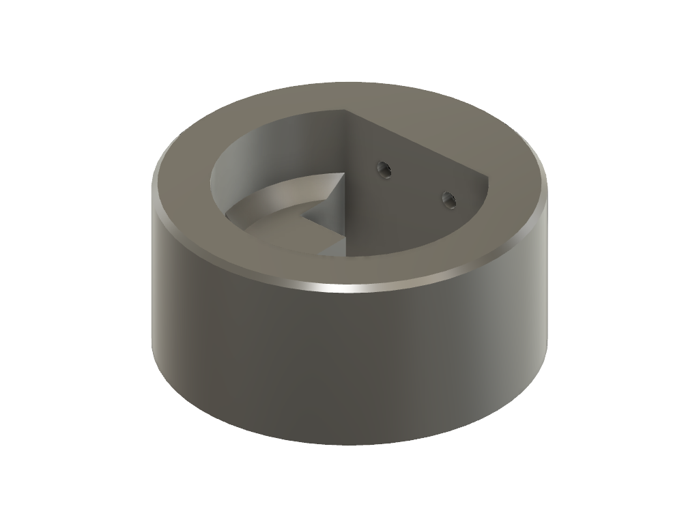
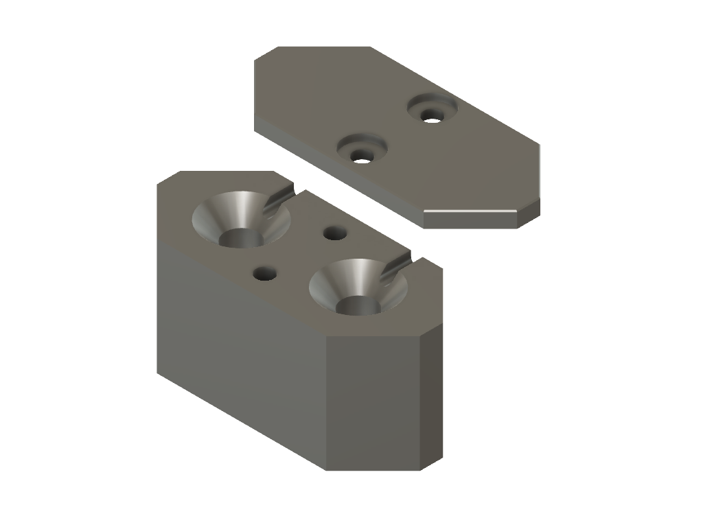

# Dokumentace HW
## Snímání hladiny v nádrži
Při řešení typu snímání hladiny v úvahu přicházely tři řešení:
* Ultrazvukové snímání hladiny
* Tenzometrické (tlakové) snímání hladiny
* Rezistivní snímání hladiny

Žhavým adeptem bylo tenzometrické snímání. Je totiž velmi spolehlivé a zároveň i velice přesné. Jeho sonda je válcovitého tvaru a nechá se ponořit do nádrže. Výstupem je proudová smyčka a obvykle bývá navržena na průmyslový standard 20 mA. Ultrazvukové řešení bylo nevhodné z hlediska krytí. Osobně s tím v tomto případě mám špatnou zkušenost. 

Protože plánujeme školní projekt využít v reálné situaci, bylo nakonec vybráno snímání hladiny pomocí rezistivních snímačů. Voda v nádrži při určité hladině zkratuje dva kontakty, které uzavřou elektrický obvod. Řešení je jednoduché a snadno implementovatelné. Jeho nevýhodou je nízké rozlišení. Tenzometrické snímání nepřipadá v úvahu, protože je vhodné pro hloubky alespoň od 1m.

Senzorů bylo v našem řešení použito celkem 5. Jako nádoba byl dostupný 25 litrový barel. Proto naše rozlišení je cca 5l.

Pro testování i provoz byla vyrobena asi 40cm dlouhá dřevěná lišta do které bylo navrtáno 6 (5+GND) otvorů pro nerezové šroubky vytvářející kontaktní plochy senzorů. Pro ukotvnení v hrdle nádrže byl vytisknut z PETG plastu díl který se nasadí na hrdlo a ukotví tak lištu v kolmé pozici. Zároveň je v hrdle dostatek místa pro vyvedení hadičky na vodu (případně kabeláž ponorného čerpadla)

 Model v .stl formátu je dostupný ve složce 3D_models. Pokud se systém v provozu osvědčí, pro lepší životnost dřevěná lišta bude nahrazena PVC trubkou.

## Snímání vlhkosti půdy
Snímání vlhkosti půdy je řešeno rezistivní sondou. Sonda byla vytvořena ze dvou mohutných hřebíků.  Opět pokud se řešen osvědčí, bude sonda vyrobená z nerezové oceli, pro lepší životnost. 

Odporová změna mezi sondami probíhá cca od 0-10kOhm/cm v závislosti na vlhkosti půdy. Druhý odpor děliče tvoří pro jednoduchost pullup rezistor v MCU. Ten má velikost od 30-50kOhm viz graf (zdroj researchgate.net/f).

Pro účely zalévání bohatě postačuje vytvoření linneární aproximace této závislosti(stejně se totiž používá zejména ta linearnější část). Programátor pouze v hlavičkovém souboru zadá dvě kalibrační hodnoty (pro 0% a pro 100% vlhkosti)

Pro ukotvení sondy byl vytisknut přípravek zprostředkující vhodný odstup sond a kontakt k přívodům.

Níže je pohled na konstrukci sondy

### Antikorozní ochrana
Protože sondy (hřebíky)jsou z běžné oceli (jinak se používají nerezové trny), může docházek ke korozi. Elektrolýza velmi výrazně napománá ke vzniku koroze na povrchu vodičů jimiž proudí DC proud. Ke zpomalení vlivu koroze se tedy vnitřní pullup rezistor připíná pouze při měření.

## Spínání čerpadla
Pro univerzálnost použitého čerpadla byl použit relátkový modul. Relé může spínat při 250V až 10A. V naší realizaci se počítá s DC čerpadlem, napájený vlastním systémem.

Modul relé přímo na desce má implementovaný proudový posilovací tranzistor. Jeho připojení k vývojové desce Arduino je tak velmi snadné.
