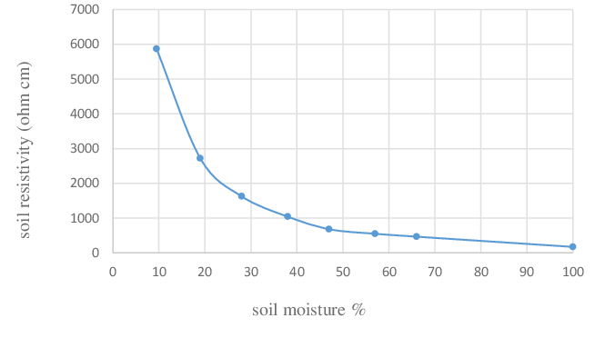
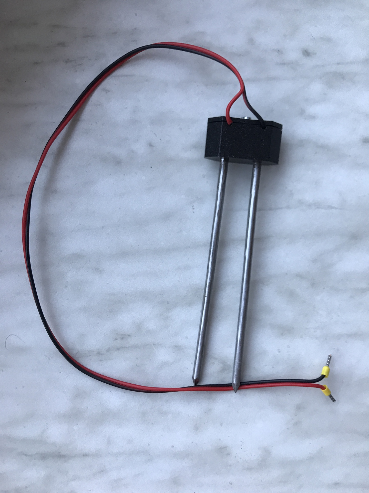
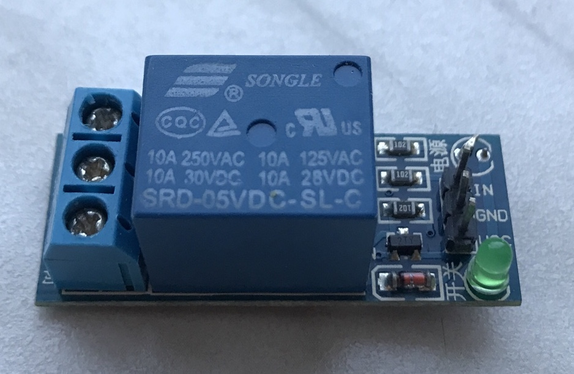

# Dokumentace HW a knihoven k nim
## Snímání hladiny v nádrži
Snímání je hotové. Práce s funkcemi viz komentáře doxygenu.

Senzorů je celkem 5 a fungují na rezistivní bázi. Takže v 25ti litrovem kanistru jest rozlišení přibližně po 5-ti litrech. Jsou snímaný digitálně (rozlišuji jen dva stavy) z praktických testů není problem s dostatečně nízkou rezistivitou vody...

Pro testování a provoz byla vyrobena asi 40cm dlouhá dřevěná lišta do které bylo navrtáno 6 (5+GND) otvorů pro nerezové šroubky vytvářející kontaktní plochy senzorů. Pro ukotvnení v hrdle nádrže byl vytisknut z plastu bazmek který se nasadí na hrdlo a ukotví tak lištu v kolmé pozici. Model v .stl formátu je dostupný ve složce 3D_models (Doufám že ta lišta nebude mít tedenci plavat... kdyžtak izolepa)

## Snímání vlhkosti půdy
Snímání vlhkosti půdy je řešeno rezistivní sondou - dva velké hřebíky zapíchnuté do hlíny. Odporová změna mezi vodiči probíhá cca od 0-10kOhm/cm v závislosti na vlhkosti půdy. Druhý odpor děliče tvoří pro jednoduchost pullup rezistor v MCU. Ten má velikost od 30-50kOhm viz graf.

Pro účely zalévání bohatě postačuje vytvoření linneární aproximace této závislosti(stejně se totiž používá zejména ta linearnější část). Programátor je pouze vyzván k tomu aby zadal dvě kalibrační hodnoty (pro 0% a pro 100%)

Pro ukotvení sondy byl vytisknut přípravek zprostředkující vhodný odstup sond a kontakt k přívodům.

Níze je pohled na konstrukci sondy

### Antikorozní ochrana
Protože sondy (hřebíky)jsou z běžné oceli (jinak se používají nerezové trny), může dochízek ke korozi. Elektrolýza velmi výrazně napománá ke vzniku koroze na povrchu vodičů jimiž proudí DC proud. Ke zpomalení vlivu koroze se tedy vnitřní pullup rezistor připíná pouze při měření.

## Spínání čerpadla
Pro univerzálnos použitého čerpadla byl použit relátkový modul. Relé může spínat při 250V až 10A. V naší realizaci se počítá s DC čerpadlem, napájený vlastním systémem.

Modul relé přímo na desce má implementovaný proudový posilovací tranzistor.
