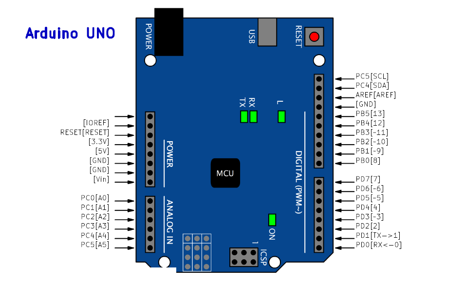
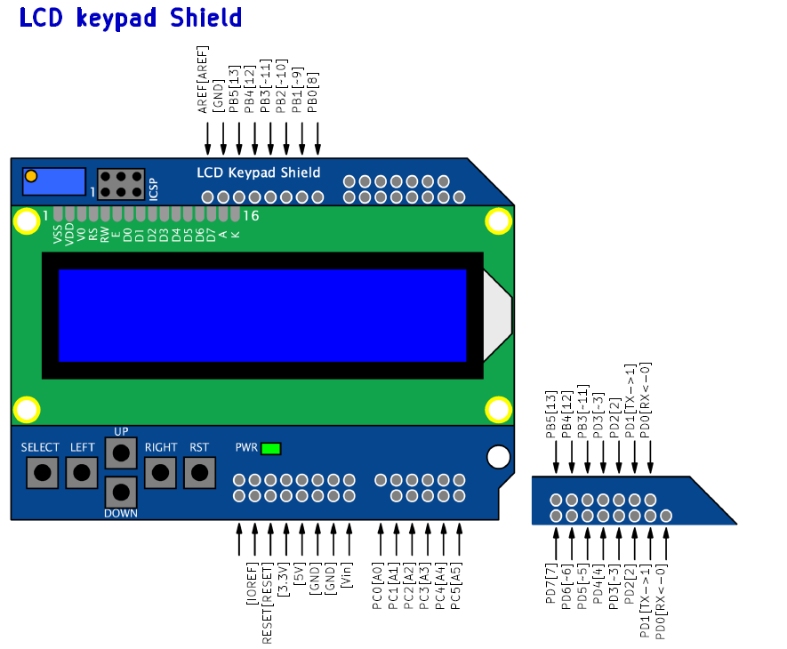
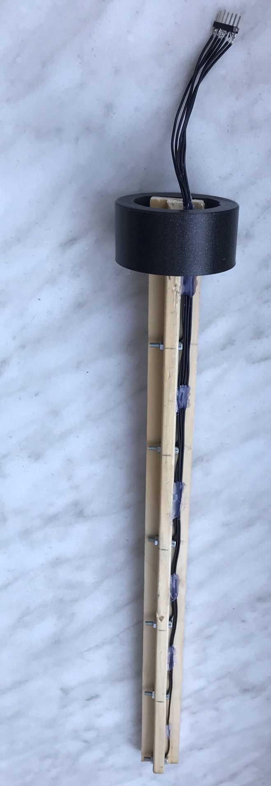
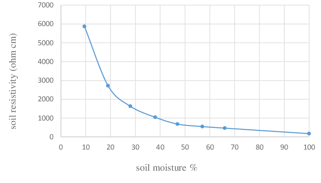
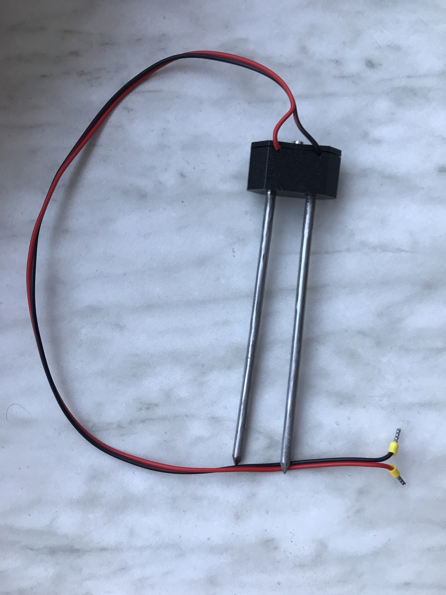
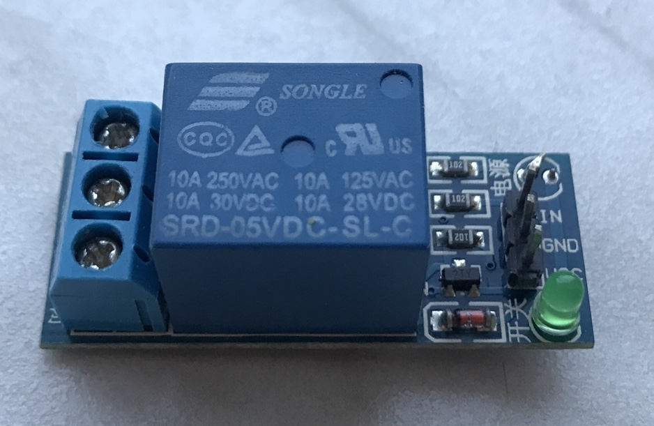

# Hardware documentation 

## Arduino Uno board
The basis is formed on an Arduino Uno board. 

# LCD keypad Shield
It is necessary to set the time at the start. For this purpose are used buttons. LCD screen is used for displaying measured values.

## Water level sensor
There are five sensors working on resistive basis. When we are using a canister with a volume of 25 litres, sensor register changes after every five litres. Each sensor distinguish only two states. (According to practical testing, there is no problem with water resistivity.)
There was made a wooden bar 40 cm long for testing purposes and practital use. In the bar are 6 holes made for stainless steel screws used as sensors contact surfaces. Wires connect the output pins from arduino and the screws on a bar.
For fixing the sensor in canister is made a plastic holder. It is put in a tank neck and holds the bar in a certain position. 3D model is available [here](3D_models/water_sensor_housing.stl).

## Soil moisture sensor
Sensor for soil moisture scanning is made as a resistive probe. Two wires are brought out of the main board and connected to nails. The nails are put in a soil and make the main part of the sensor. We watch resistance changes between the wires, it reaches from 0 to 10kOhm/cm. The second resistance of the divider is made out of pullup resistor in MCU and it's range is from 30 to 50kOhm.

It is enough to aproximate this dependence with linear course. A programmer has to set two calibration values, one for 0 % and one for 100 %.

We need also to keep the spacing between the two contacts (nails). To solve that problem, it is made a plastic holder. It keeps the nails in certain positoin and data is not affected by improper handling. The 3D model for the socket is available [here](3D_models/humidity_sensor_housing_socket.stl) and for the lid [here](3D_models/humidity_sensor_housing_lid.stl).

### Corrosion protection
The nails are made out of steel, which subject to corrosion. Electrolysis cignificantly helps causing the corrosion and in the sensor there is a direct current (DC) flowing on the surface. As a solution is the internal pullup resistor switched only when measuring is done. The process of corrosion is slowed down.

## Pump switching
For the purpose of pump switching is made a modul with a relay. The relay can switches at 250 V and up to 10 A. In this project is used a DC pump powered by its own system.
The molul of the relay on a desk has implemented current amplifying transistor.

