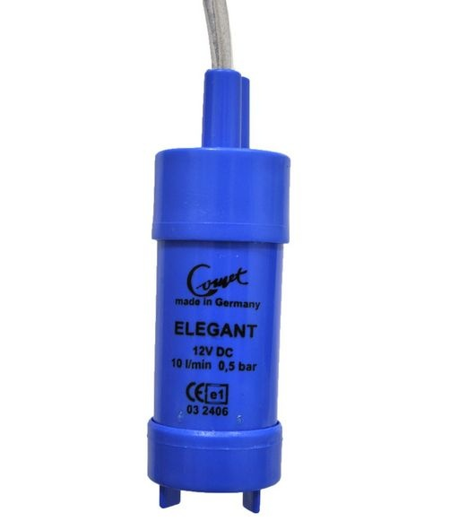

# Hardware documentation 

## Arduino Uno board
The basis is formed on an microrontroller board called Arduino Uno based on the ATmega328P ([datasheet](../ATmega328p_Datasheet.pdf)). It has 20 digital (input or output) pins and runs with 16 Mhz frequency. The power supply and data tranfer is solved by USB connection with PC.

# LCD keypad Shield
The LCD Keypad Shield  is compatible with Arduino boards. It consists of a 1602 white character blue backlight LCD. The keypad consists of 5 keys (select, up, right, down and left). For reading the key value only one ADC channel is used, the evaluation is performed with the help of five stage voltage divider. 
[See datasheet here.](../Datasheet_DFR0009_D-Robotics.pdf)

## Water level sensor
There are five sensors working on resistive basis. When we are using a canister with a volume of 25 litres, sensor registers changes after every five litres. Each sensor distinguishes only two states. (According to practical testing, there is no problem with water resistivity.)
For testing purposes and practital use a 40 cm long wooden bar has been made. In the bar are 6 holes made for stainless steel screws used as sensors contact surfaces. Wires connect the output pins from arduino and the screws on a bar.
Plastic holder has been made for fixing the sensor in the canister. It is put in a tank neck and holds the bar in a certain position. 3D model is available [here](3D_models/water_sensor_housing.stl).

## Soil moisture sensor
Sensor for soil moisture scanning is made as a resistive probe. Two wires are brought out of the main board and connected to nails. The nails are put in a soil and make the main part of the sensor. We watch resistance changes between the wires, it reaches from 0 to 10kOhm/cm. The second resistance of the divider is made out of pullup resistor in MCU and it's range is from 30 to 50kOhm.

It is enough to aproximate this dependence with linear course. A programmer has to set two calibration values, one for 0 % and one for 100 %.

We need also to keep the spacing between the two contacts (nails). To solve that problem, a plastic holder has been made. It keeps the nails in certain position and data is not affected by improper handling. The 3D model for the socket is available [here](3D_models/humidity_sensor_housing_socket.stl) and for the lid [here](3D_models/humidity_sensor_housing_lid.stl).

### Corrosion protection
The nails are made out of steel, which are subjected to quick corrosion. Electrolysis significantly helps to cause the corrosion and in the sensor there is a direct current (DC) flowing on the surface. The solution is an internal pullup resistor, switched only when measuring is done. The process of corrosion is therefore slowed down. 

## Water pump
The water pump intended for this project for pumping water into a flowerpot is made by COMET-pumpen. It is a submersible pump with 12 V DC input voltage.The maximum throughput is 10l/min and it can run up to 500 hours. For more dails see the [datasheet](../Datasheet_comet-pumpen-elegant.pdf).

## Pump switching
Pump swithing is solved by module with relay. The relay can switches at 250 V up to 10 A. The pump is suposed to has it's own power supply system. The details of relay are available [here](../Datasheet_SRD-12VDC-xx-x_ETC.pdf).
