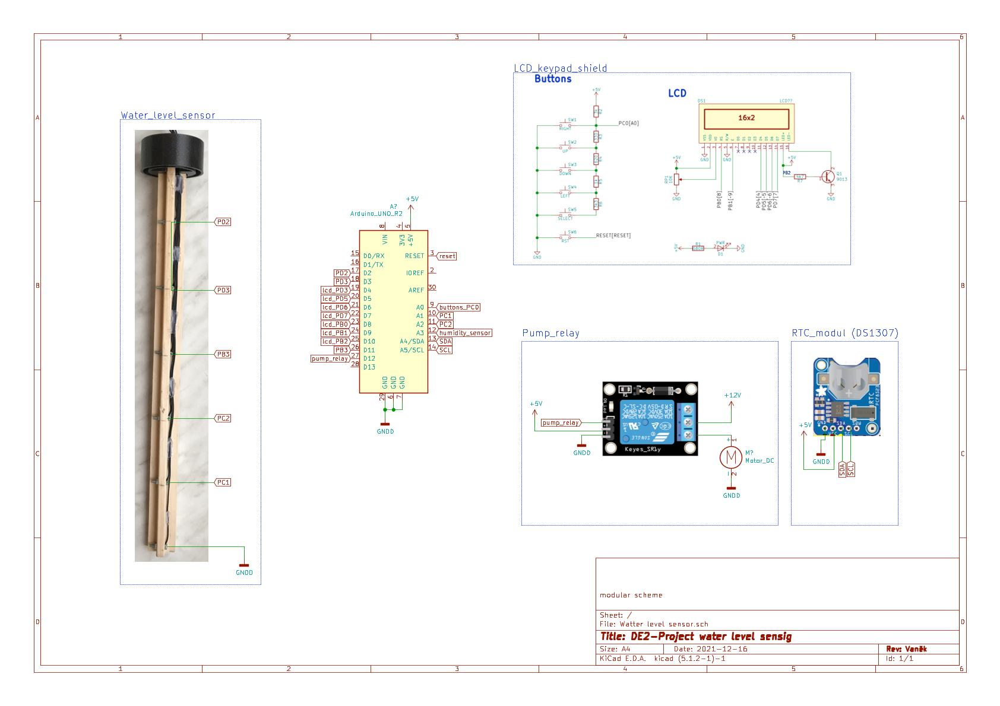
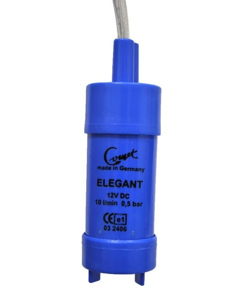
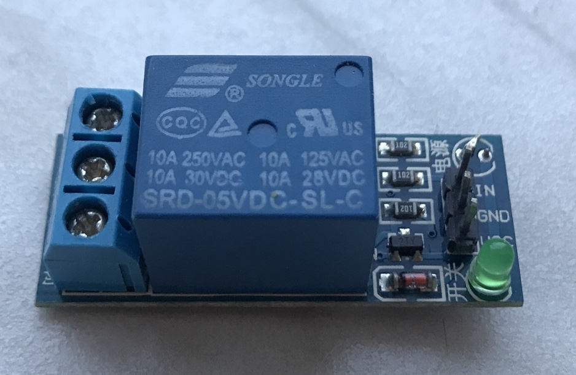

# WATER TANK CONROLLER

### Team members

* Ondřej Soukeník (responsible for LCD keypad, MENU)
* Pavel Vaněk (responsible for Sensors)
* Michaela Ryšavá (responsible for RTC, Main file)
* Zdeňka Varmužová (responsible for Documentation)

Link to this file in your GitHub repository:

[https://github.com/ondrasouk/Digital-electronics-2-project](https://github.com/ondrasouk/Digital-electronics-2-project)

### Table of contents

* [Project objectives](#objectives)
* [Hardware description](#hardware)
* [Libraries description](#libs)
* [Main application](#main)
* [Video](#video)
* [References](#references)

<a name="objectives"></a>

## Project objectives

* the task:
    * Water tank controller. The following can be used: water level measurement, pump control, rain sensor and others.
    * [Link](https://github.com/tomas-fryza/Digital-electronics-2/tree/master/Labs/project) to the task.

* to do:
    * Preparation
        * [x] Block structure design
        * [x] The split of work
    * Realization
        * [x] Use of sensors
        * [x] Individual blocks of code
        * [x] Verification of the functionality
        * [x] Generating HEX file
    * Presentation
        * [x] Documentation
        * [x] Discussion of results
        * [x] Video presentation

* done:
    * Irrigation system. Water level - controlling sensor is placed in the tank and measures the water level (5 levels). Sensor for measuring soil moisture is placed in a soil and both send data to control logic, where are evaluated. If there is enough water in the tank and soil moisture is under specific value, water pump is activated. After certain time period another measuring is made. User can choose from three modes of irrigation. More info about the system is in the [video](https://youtu.be/Qcah5Nm7IAs).

<a name="hardware"></a>

## Hardware description

The solution is designed on an Arduino Uno board with sensors and a water pump connected to external pins.




### Arduino Uno board 
The project is made for application on an Adruino Uno board with ATmega328P. 
[Arduino Uno board](Docs/arduino_shield.pdf)


For more informations see [hardware documentation](Docs/HW/readme.md).

### LCD keypad Shield
LCD and buttons are used for moving in the menu and displaying measured values. The LCD keypad shield is compatible with Arduino board.
[LCD keypad Shield](Docs/arduino_shield.pdf)


For more informations see [hardware documentation](Docs/HW/readme.md).

### Water lever sensor
The solution contains five sensors working on a resistive basis, which are placed on a panel. The top of the panel is attached to the lid of a canister with water. Six wires are brought out of the main board to the panel. One is for the reference (ground), other five are each in different height. The sensor contact surfaces are stainless steel screws placed on the panel. 


For more informations see [hardware documentation](Docs/HW/readme.md).

### Soil moisture sensor
The sensor is based on different conductivities of the soil according to the moisture of the soil. Two wires are connected to the nails, which are placed in the soil. The resistivity is evaluated in central logic.


For more informations see [hardware documentation](Docs/HW/readme.md).

For preventing nails from quick corrosion due to electrolysis is the internal pullup resistor switched only when measuring is done.

### Water pump
Water pumping is solved by ELEGANT's submersible pump with 12 V DC and 2,2 A input. The pump is designed for hoses with 10 mm inner diameter, which is suitable for the purposes for our project.



For more informations see [hardware documentation](Docs/HW/readme.md).
NOTE: Testing has been done with another water pump. The pump mentioned above is only intended.

### Pump switching
Pump switching module is made with a relay. It can switches at 250 V up to 10 A.



For more informations see [hardware documentation](Docs/HW/readme.md).

<a name="libs"></a>

## Libraries description
For more info see the doxygen documentation.

### ``` timer.h ```
* Contains macros for controlling the timer modules.
* Template code is made by Tomas Fryza, BUT.
* Finished by Ondrej Soukenik.

### ``` uart.h ```
* Used to transmit and receive data through the built in UART.
* Author - Peter Fleury.

### ``` lcd.h ```
* Constains routines for interfacing a HD44780U-based character LCD display.
* Author - Peter Fleury.

### ``` lcd_buttons.h ```
* Includes function for button debouncing and button detection.

### ``` lcd_definitions.h ```
* Adjust the display settings.
* Author - Peter Fleury (Tomas Fryza, BUT).

### ``` level_sens.h ```
* Contains functions for initialising and reading data from water level sensors.

### ``` hum_sens.h ```
* Consist rutines to work with soil humidity sensor.

### ``` rtc.h ```
* This library was taken over and used with rtc module.


<a name="main"></a>

## Main application


<a name="video"></a>

## Video

[Link to video](https://youtu.be/Qcah5Nm7IAs)

<a name="references"></a>

## References

1. Arduino Uno and LCD keypad shield [schematic](Docs/arduino_shield.pdf)
2. ATmega328P [datasheet](Docs/ATmega328P_Datasheet.pdf)
3. LCD Keypad Shield [datasheet](Docs/Datasheet_DFR0009_D-Robotics.pdf)
4. [Relay](Docs/Datasheet_SRD-12VDC-xx-x_ETC.pdf) used for pump switching
5. Elegant submersible pump [datasheet](Docs/Datasheet_comet-pumpen-elegant.pdf)
