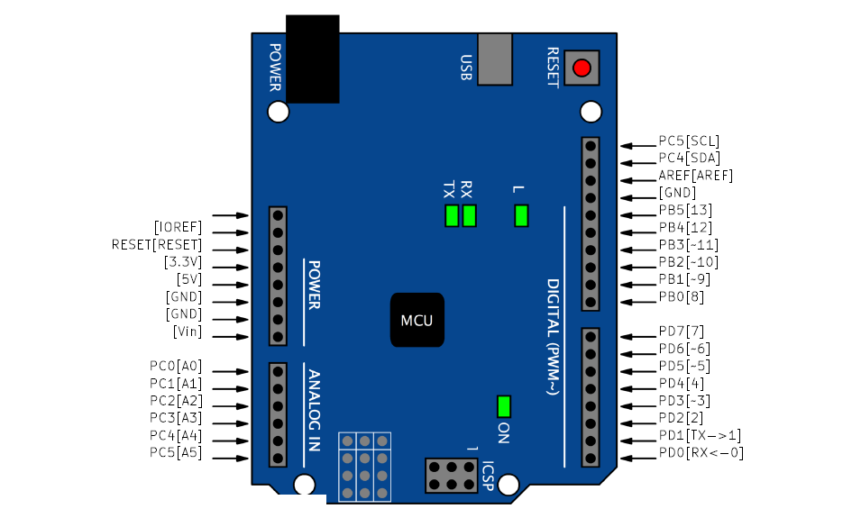
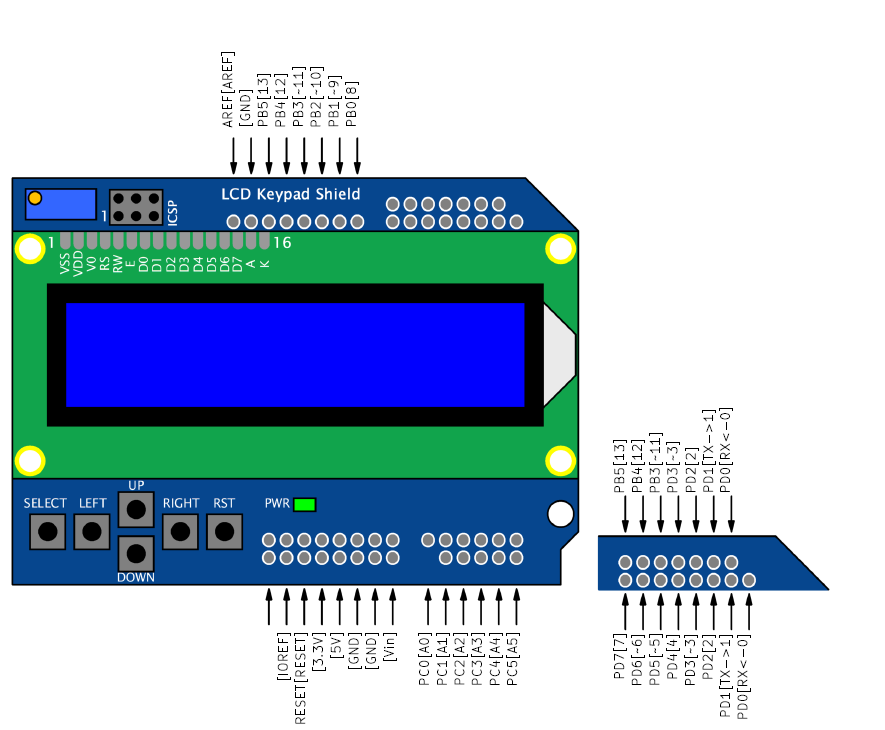
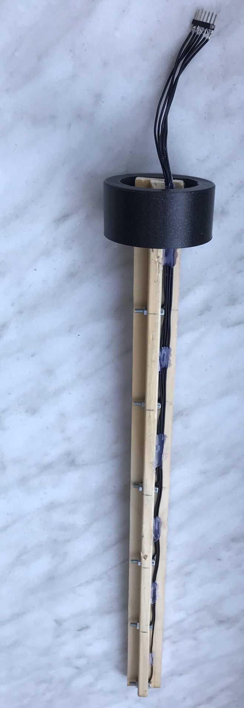

# WATER TANK CONROLLER

### Team members

* Ondřej Soukeník (responsible for LCD keypad, MENU)
* Pavel Vaněk (responsible for Sensors)
* Michaela Ryšavá (responsible for RTC, Main file)
* Zdeňka Varmužová (responsible for Documentation)

Link to this file in your GitHub repository:

[https://github.com/ondrasouk/Digital-electronics-2-project](https://github.com/ondrasouk/Digital-electronics-2-project)

### Table of contents

* [Project objectives](#objectives)
* [Hardware description](#hardware)
* [Libraries description](#libs)
* [Main application](#main)
* [Video](#video)
* [References](#references)

<a name="objectives"></a>

## Project objectives

* the task:
    * Water tank controller. The following can be used: water level measurement, pump control, rain sensor, and others.

* to do:
    * Preparation
        * [x] Block structure design
        * [x] The split of work
    * Realization
        * [x] Use of sensors
        * [x] Individual blocks of code
        * [ ] Verification of the functionality of the whole
        * [ ] Generating HEX file
    * Presentation
        * [ ] Documentation
        * [ ] Discussion of results
        * [ ] Video presentation

* done:
    * Irrigation system. Water controlling sensor is placed in the tank and senses the water level (5 levels). Sensor for measuring soil moisture is placed in a soil and both sends data to control logic, where are evaluated. If there is enough water in the tank and soil moisture is under 60 % water pump is activated. After certain time period is made another measuring.

<a name="hardware"></a>

## Hardware description

The solution is designed on an Arduino Uno board with sensors connected to external pins.

### Arduino Uno board 
[Arduino Uno board](Docs/arduino_shield.pdf)




### LCD keypad Shield
[LCD keypad Shield](Docs/arduino_shield.pdf)


### Water lever sensor
The solution contains of five sensors working on a resistive basis, placed on a panel. The top of the panel is attached to the lid of a canister with water. Six wires are brought out of the main board to the panel. One is for the reference (ground), other five are each in different height. The sensor contact surfaces are stainless steel screws placed on the panel. 



For more informations see TODO (doxygen - libs doc) or [hardware documentation](Docs/HW/readme.md).

### Soil moisture sensor
The sensor is based on different conductivities of the soil according to the moisture of the soil. Two wires are cennected to the nails, which are placed in the soil. The resistivity is evaluated in central logic.


For more informations see TODO (doxygen - libs doc) or [hardware documentation](Docs/HW/readme.md).

<a name="libs"></a>

## Libraries description
TODO add doxygen doc - links

### ``` timer.h ```
* Contains macros for controlling the timer modules.
* Template code is made by Tomas Fryza, BUT.
* Finished by Ondrej Soukenik.

### ``` uart.h ```
* Used to transmit and receive data through the built in UART.
* Author - Peter Fleury.

### ``` lcd.h ```
* Constains routines for interfacing a HD44780U-based character LCD display.
* Author - Peter Fleury.

### ``` lcd_buttons.h ```


### ``` lcd_definitions.h ```
* Adjust the display settings.
* Author - Peter Fleury (Tomas Fryza, BUT).

### ``` level_sens.h ```
* Contains functions for initialising and reading data from water level sensors.

### ``` hum_sens.h ```
* Consist rutines to work with soil humidity sensor.

<a name="main"></a>

## Main application

Write your text here.

<a name="video"></a>

## Video

Write your text here

<a name="references"></a>

## References

1. Arduino Uno and LCD keypad shield [schematic](Docs/arduino_shield.pdf)
2. ATmega328P [datasheet](Docs/ATmega328P_Datasheet.pdf)
3. ...